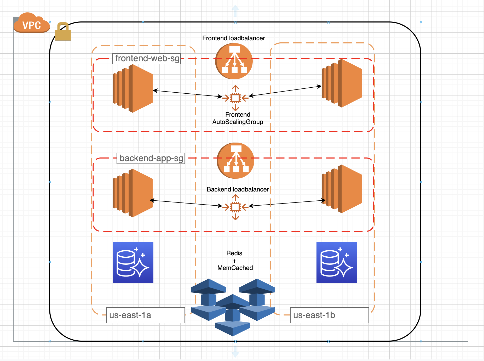

# Terraform-aws-example
This repo contains terraform code that creates following infrastructure

- Cluster of application server instances
- Cluster of worker server instances
- AWS LB in front of this cluster
- Aurora database cluster (MySQL Engine, at least 3 instances)
- Memcached cluster (elasticache)
- Redis cluster (elasticache)

# Architectural Diagram

# Github Actions Workflow

- Add your AWS_ACCESS_KEY_ID and AWS_ACCESS_SECRET_KEY to the github secrets
- There is already ci.yml and cd.yml github actions workflows exist in the repo to run terraform format, validate, plan as part of checks.
- cd.yml can be extended to run apply with auto-approve option, but it is disabled as part of run, if you want to run apply, prepare to add destroy as well.

Actions - https://github.com/pkbhaga/terraform-aws-example/actions

# Code structure

- terraform.tfvars - This is a variable input file to alter the infrastructure based on requirement
- variables.tf - This file declares all the variables required for terraform code.
- outputs.tf - This file declares all the output variables that emitted out of terraform apply.
- backend.tf - Configured S3 backend for keeping terraform state
- provider.tf - Declares high level providers for AWS
- main.tf - Declares AWS specific variables like region, name and AMI used by instances
- backend-elb.tf, backend-asg.tf - Declares backend loadbalancer, backend autoscaling groups 
- frontend-elb.tf, frontend-asg.tf - Declares frontend loadbalancer, frontend autoscaling groups 
- auroradb.tf - Declares Auroradb cluster code
- redis.tf - Declares elasticache redis cluster code
- memcached.tf - Declares elasticache memcached cluster code

# Code caveats
- No tests were written, we can leaverage terratest to write some testing for terraform structure
- VPC and Subnets are hardcoded IP's, they are not dynamically created.
- Currently this code uses community modules for VPC, LB, Aurora-RDS, Redis, Memcached, further can be extended into individual modules.
